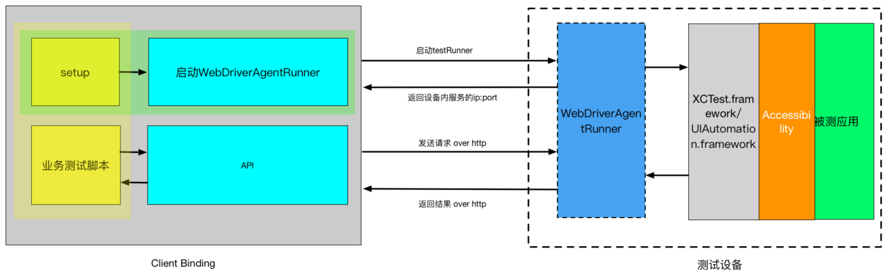

近期，微信[跳一跳外挂](https://github.com/wangshub/wechat_jump_game)火了，看了作者的思路和教程，感觉挺简单，不过在实现（照葫芦画瓢）的过程中，遭遇到不少问题。
 
 

其中之一便是，真机调试 WDA，参考 iOS 真机如何安装 [WebDriverAgent · TesterHome](https://testerhome.com/topics/7220)，下面就按照这篇教程，各个击破真机调试WDA 的问题：

# 开始

首先按照教程，尽量更新下Xcode 的版本，从github 上下载WDA 的最新版本，直接克隆到本地

```
git clone https://github.com/facebook/WebDriverAgent.git 
```

切换到WDA 根目录，运行初始化脚本

```
cd WebDriverAgent
./Scripts/bootstrap.sh
```

以上脚本是安装依赖库，同时使用npm 打包响应的js 文件。感兴趣的同学可以浏览脚本文件，同级目录下还有一个`build.sh`，也可以直接执行该脚本来编译安装WDA。当然，初次接触，希望一步步操作的话会好一些。

如果中途出现错误，需要先解决，否则接下来的操作都无法进行。

# 编译运行

接下来，通过Xcode 打开`WebDriverAgent.xcodeproj` 这个文件。

可以先尝试编译一下，方便定位目前存在的问题，使用组合键或者通过鼠标操作

```
command + b
```

这个时候，肯定会有提示配置证书的问题，真机调试证书是必须设置的。可以设置个人开发者免费证书，或者其他付费证书。


然后选择`WebDriverAgentRunner` 这个Target 和 真机设备，执行测试。组合键`command+u`，或从菜单栏Product 中通过鼠标操作

> 一切正常的话，手机上会出现一个无图标的WebDriverAgent应用，启动之后，马上又返回到桌面。这是很正常的不要奇怪。

应用教程中的原话，上述现象正常，但是也有可能会在控制台报错，从而无法打印出ip 地址。

当把所有的流程重新捋一遍，你会发现，根本发现不了哪一步做错了，我遇到的情况就是，一直停留在控制台的那里，不会出现奇迹。经过一番搜索，发现[有个帖子](https://testerhome.com/topics/9666)里的警告提示，我决定放手一搏！

> 你们以为这样就能运行吗？
> 
> 并不是！
> 最关键一步来了：
> 
> 你要用数据线连着电脑重启你的手机！！！！
> 
> 你要用数据线连着电脑重启你的手机！！！！
> 
> 你要用数据线连着电脑重启你的手机！！！！
> 
> 重要的话要说三遍！

反正是在保证数据线连接的情况下，重启一下手机，然后重新build 就成功看到ip 地址！而且在以后操作中，这种情况还会复现，所以重启手机吧，不用浪费无辜的时间研究~

通过上面给出的IP和端口，加上`/status`合成一个url地址。例如`http://10.0.0.1:8100/status`，然后浏览器打开。如果出现一串JSON输出，说明WDA安装成功了。

# 端口转发

有些国产的iPhone机器通过手机的IP和端口还不能访问，此时需要将手机的端口转发到Mac上。关于这个问题，我是通过端口转发才看到效果，所以你也应该会遇到同样的问题。

```
$ brew install imobiledevice
$ iproxy 8100 8100 [4c47766e78f9d84e1da55b07d69f2747e9fb4f71]
```

使用iproxy --help 可以查到更具体的用法。 这时通过访问http://localhost:8100/status确认WDA是否运行成功。

而inspector的地址是http://localhost:8100/inspector， inspector是用来查看UI的图层，方便写测试脚本用。

> 注：端口转发后，域名不再是IP 地址，而是你的本机IP或者使用`localhost`+ 端口号

# 最终效果

完成上述操作以后，可以随意开启应用内的某个应用，就能看到如下效果。


这里结合 [Appium Desktop](https://testerhome.com/topics/7840) 一起食用，效果更佳~
 
Good luck!!!

# 实战

相信你会对这个感兴趣，通过WDA 做自动化测试，恩！

接下来演示一下怎么用ATX打开iPhone自带的计时器，开始然后退出

``` python
#! /usr/local/bin/python3
# -*- coding: utf-8 -*-

import atx

d = atx.connect("http://localhost:8100")
d.start_app("com.apple.mobiletimer")
d(text=u'计时器').click()
d(text=u'开始计时').click()
d(text=u'取消').click()
d.stop_app()

```

执行以上代码即可体验

# 结尾

最后墙裂推荐基于Python自动化框架地址 [https://github.com/NetEaseGame/ATX](https://github.com/NetEaseGame/ATX)

Xcode问题多多，愿WDA与你同在。

# 参考链接

[ATX 文档 - iOS 真机如何安装 WebDriverAgent
](https://testerhome.com/topics/7220)

[Macaca App Inspector 2.0 发布](https://testerhome.com/topics/8820#reply47)

[Appium Desktop 简单介绍 —— xcodebuild failed with code 65 解决](https://testerhome.com/topics/7840)

[WebDriverAgent 天坑记](https://testerhome.com/topics/9666)

[启动 WebDriverAgent 后再启动 appium，运行脚本一直卡在 Waiting for WebDriverAgent to start on device](https://testerhome.com/topics/7324)

[ATX 支持 iOS10 手机测试 方法说明](https://testerhome.com/topics/6331)
