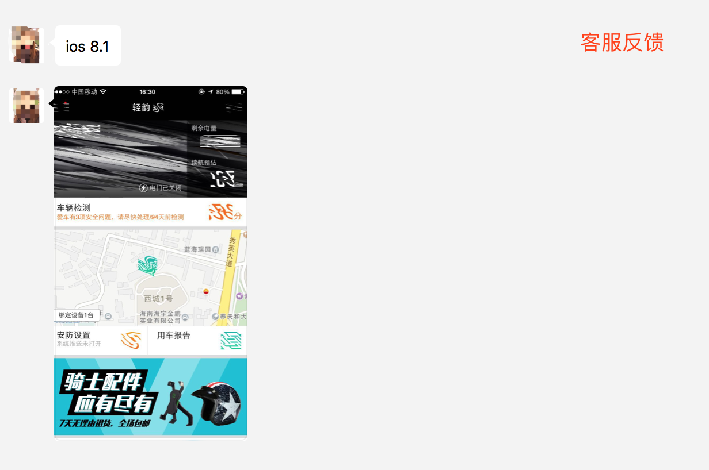
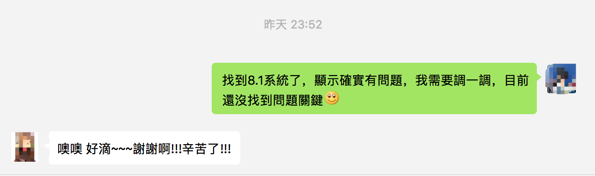
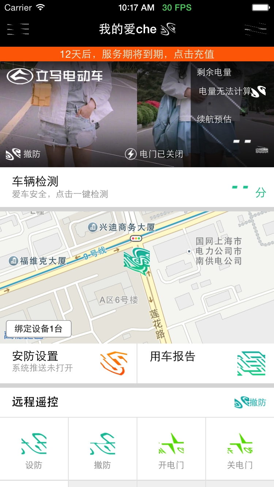
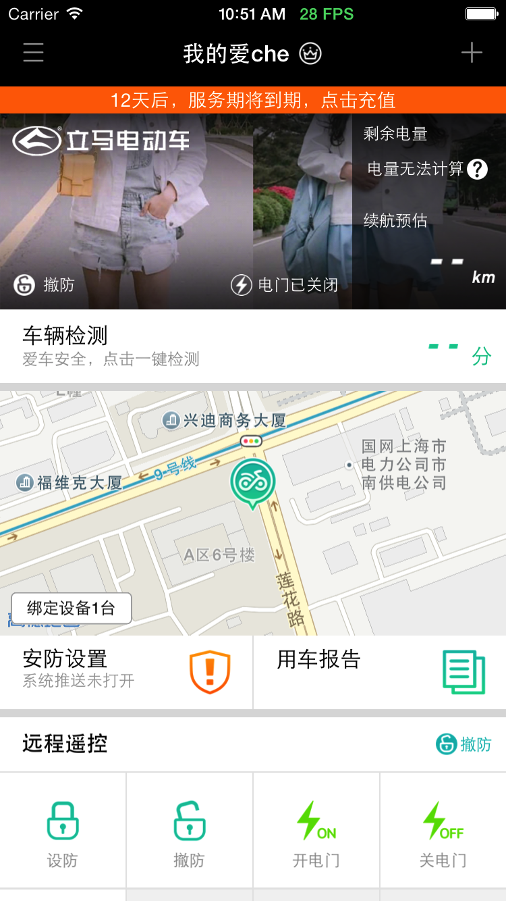

趁着下载Xcode 9.1 的空隙，在周末的早晨记录一下这个坑，希望能解决相同遭遇同行的困惑。

## 始因

昨天刚发布了适配iPhone X 的最新版本，之所以使用Xcode 9.2打包，是因为早期的适配，通过Xcode 8.2打包，安装到iPhone X上显示的效果是没有适配。

这个也是无法解释的，我们开发使用的Xcode9，在适配过程中没有遇到该问题，总是升级就对了。

刚好最近苹果爹发布了Xcode 9.2，就索性升级到最新版本。

持续化集成就是方便，代码提交以后，喝杯咖啡的工具，就上传成功，等待审核。

也就是在昨天中午，收到审核通过的提醒，很奇怪，这个时候应该是他们休息的时间。

然后，就非常肯定，因为在适配的过程中，特意找了两个iPhone X的用户帮助测试体验。随着审核通过，就很快发布出去。

## 问题

大概下午3点钟，距离发布版本只过了3 个小时左右。收到客服妹子的一个大写的问号。

这一瞬间，整个人都是懵的，慌忙让用户重启APP，重启系统，升级系统，最后被用户拒绝掉。

既然是必现的问题，不能将问题推到升级系统上，该解决还是要尽快解决的。

接着就开始着手另外一个项目，晚上回到家开始思考，问题存在的版本近期究竟改了什么内容。同时也下载了iOS8.1 的模拟器，使用最新版本的Xcode 运行看了下效果，确实如此是复现的。

所以，要马上改变态度，和客服同志搞好关系，早点认错才能走得更远。

## 回忆

### 1. 删掉LaunchScreen.sb 文件

为了适配iPhone X 的启动图，同时在启动后使用启动图做了简单的效果，决定使用LaunchImage 的方式设置启动图。

在更改代码后，尝试了一下修改结果，依然是非正常的。

效果如下，丝毫没有改变：

### 2. Xcode 版本升级

这次的改动比较小，所以在排除上述的改动后，直接想到的就是可能就是这个问题，但是很少会怀疑苹果爹会挖这么大的坑，让开发者跳进去。

不管如何，降级版本试试就知道是不是这个原因。

| Xcode9.2 | Xcode9.1 |
| ------| ------ |
|  |  |

通过上述对比，确定问题就处在Xcode 版本上。

## 解决方案

### 1. 等苹果爹更新

如果苹果爹一直没注意到这个问题，或者没有人提，谁知道还要等多久？
关于此问题，我已经向苹果爹提交了bug，期待后续修复：
	
[ProblemID=35948702](https://bugreport.apple.com/web/?problemID=35948702)

### 2. 先降级Xcode

确切的说，这是目前最快捷的一个方式，保证没有问题。
	
### 3. 改变图片资源存储

图片不要放在asset里面，方法放在bundle里面就没问题。不知道是Xcode9.2bug还是没设置相关属性。

## 参考链接

* [Xcode9.2 运行iOS8.1图片异常](http://www.cocoachina.com/bbs/read.php?tid=1729079)